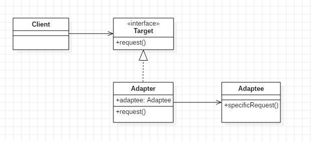
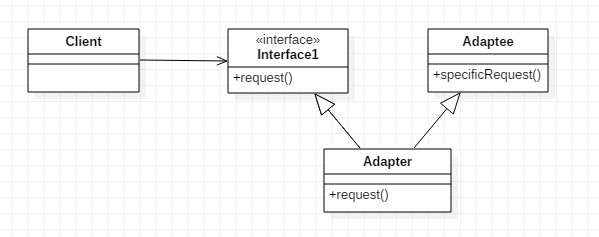
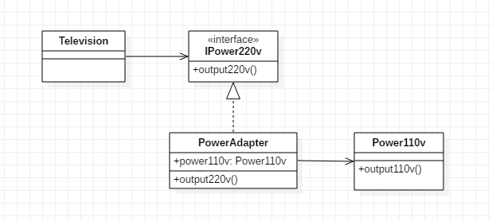
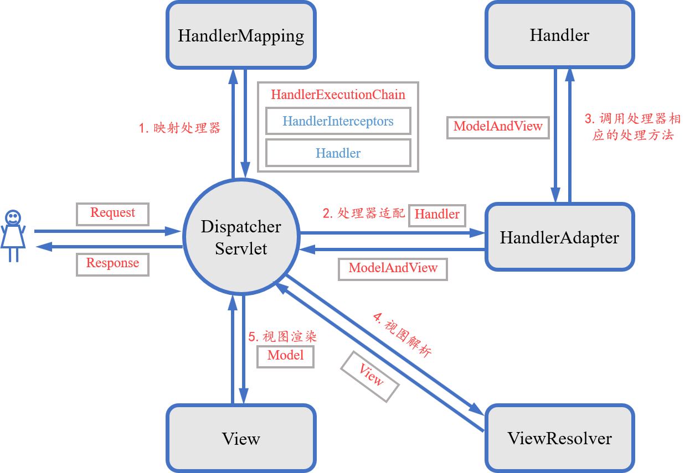
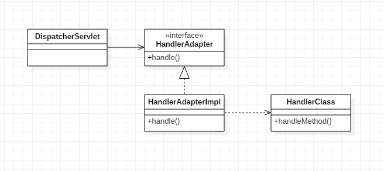
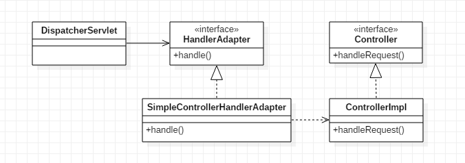
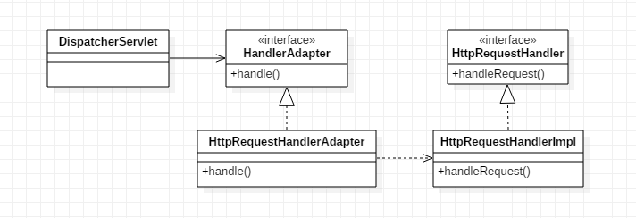

### 模式结构
适配器模式包含的角色：
- 目标接口（Target）：客户要用的特定领域的接口
- 适配器（Adapter）：调用另一个接口，作为一个转换器，对适配者和抽象目标类进行适配
- 适配者（Adaptee）：被适配的角色，它定义了一个已经存在的接口，这个接口需要适配
- 客户（Client）

适配器模式有**对象适配器**和**类适配器**两种实现。

#### 对象适配器


#### 类适配器


客户端期待使用request()方法，但Adaptee类并没有该方法，为了使Client能够使用Adaptee类，提供一个适配器类Adapter，Adapter实现了request()方法，并在request()方法中调用Adaptee类的功能，最终使Client能够间接使用Adaptee类的功能。

> 对象适配器的实现中适配器是通过**组合**的方式来重用适配者的功能；类适配器的实现中适配器是通过**继承**的方式来重用适配者的功能。

### 示例
见本目录下的其他类



这里Television是客户，IPower220v是目标接口，PowerAdapter是适配器，Power110v是适配者。

比如国内电视需要的输入电压为220v，而国外标准输出电压为110v，我们借助电源适配器将110v转换成220v。

### 具体应用分析
1. SpringMVC中的HandlerAdapter



由上图可知，DispatcherServlet接收到请求后会通过HandlerMapping来获取请求对应的处理器Handler，而处理器有多种实现（Controller、HttpRequestHandler、HandlerMethod等），不同的处理器实现处理请求的方式不同，作为前端控制器，DispatcherServlet并不关心如何根据请求选择合适处理器这类细节，它定义了一个统一的方法（HandlerAdapter的handle()方法）来执行请求，即将不同处理器的处理方法统一适配成handle()方法。

```java
public interface HandlerAdapter {

	boolean supports(Object handler);

	ModelAndView handle(HttpServletRequest request, HttpServletResponse response, Object handler) throws Exception;

	long getLastModified(HttpServletRequest request, Object handler);

}
```



其中DispatcherServlet为Client，HandlerAdapter为Target，HandlerAdapterImpl(表示HandlerAdapter的实现类)为Adapter，HandlerClass（表示处理器实现类）为Adaptee。

- 当处理器为Controller对象时，适配器为SimpleControllerHandlerAdapter
```java
public interface Controller {

	ModelAndView handleRequest(HttpServletRequest request, HttpServletResponse response) throws Exception;

}
```



- 当处理器为HttpRequestHandler对象时，适配器为HttpRequestHandlerAdapter

```java
public interface HttpRequestHandler {

	void handleRequest(HttpServletRequest request, HttpServletResponse response)
			throws ServletException, IOException;

}
```



### 应用场景
- 系统需要使用现有的类，而这些类的接口不符合系统的需要。
- 想要建立一个可以重复使用的类，用于与一些彼此之间没有太大关联的一些类，包括一些可能在将来引进的类一起工作。
- 对于对象适配器，采用组合的方式进行扩展，一个适配器可以把多种不同的源（源类及其子类）适配到同一个目标；相比于类适配器，这种方式无法重新定义adaptee的行为，但可以很方便地增加新的行为。
- 对于类适配器，采用继承的方式进行扩展，adapter可以重新定义adaptee的行为，但通过继承方式耦合度较高，且Java不支持多继承，当adapter需要继承其它类时该方式无法实现。

### 总结
- 适配器模式用于将一个接口转换成客户希望的另一个接口，适配器模式使接口不兼容的那些类可以一起工作，其别名为包装器。适配器模式既可以作为类结构型模式，也可以作为对象结构型模式。
- 适配器模式的主要优点是将目标类和适配者类解耦，增加了类的透明性和复用性，同时系统的灵活性和扩展性都非常好，更换适配器或者增加新的适配器都非常方便；类适配器模式的缺点是适配器类在很多编程语言中不能同时适配多个适配者类，对象适配器模式的缺点是很重新定义换适配者类的方法。


