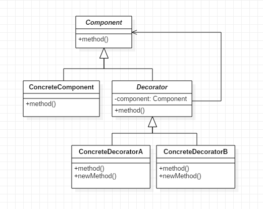
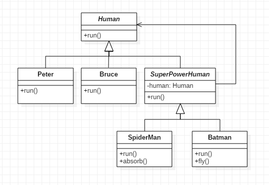
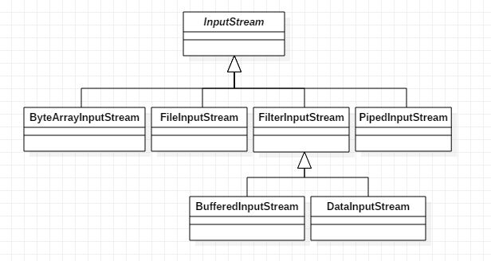
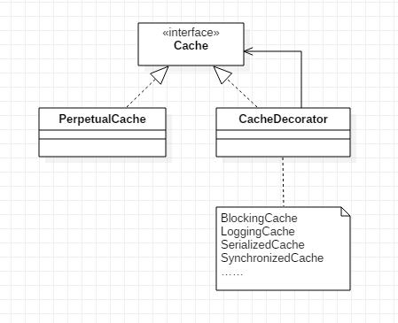

### 模式结构
装饰器模式包含的角色：
- 抽象构件（Component）：定义了对象的接口，可以给这些对象动态增加职责
- 具体构件（ConcreteComponent）：定义了具体的构件对象，实现了在抽象构件中声明的方法，装饰器可以给它增加额外的职责
- 抽象装饰类（Decorator）：抽象构件类的子类，用于给具体构件增加职责，但是具体职责在其子类中实现
- 具体装饰类（ConcreteDecorator）：抽象装饰类的子类，负责向构件添加新的职责

装饰者（Decorator）和被装饰者（Component）之间的继承关系只是为了保证二者具有相同的类型，因为装饰者必须能够取代被装饰者。

装饰者使用对象组合的方式来获得被装饰者的行为。因为这种方式相比于继承降低了装饰者和被装饰者之间的耦合性，如果增加新的行为，我们可以实现新的装饰器而不用修改现有的代码。

### 示例
见本目录下的其他类

### 具体应用分析
1. Java I/O

其中InputStream为抽象构件角色，ByteArrayInputStream、FileInputStream、PipedInputStream为具体构件角色，FilterInputStream为抽象装饰器角色，BufferedInputStream、DataInputStream为具体装饰器角色。

FilterInputStream持有InputStream对象，它的所有方法只是代理了InputStream的功能，BufferedInputStream扩展了InputStream的功能，使其对数据的操作带有缓冲功能。

2. MyBatis的缓存Cache

MyBatis默认开启一级缓存，一级缓存是在 BaseExecutor 被初始化的。一级缓存的类型为 PerpetualCache，没有被其他缓存类装饰过。当用户开启了二级缓存，系统初始化过程中会根据配置文件中的信息对PerpetualCache缓存对象进行装饰，以此来获得更高级的功能。如BlockingCache,如果缓存中某个Cachekay对应的元素找不到就会对该Cachekey进行加锁；如LruCache，会使Cache具有LRU方式的数据淘汰策略。

### 应用场景
- 在不影响其他对象的情况下，以动态、透明的方式给单个对象增加职责。
- 需要动态地给一个对象增加功能，这些功能也可以动态地被撤销。（通过配置文件在运行时选择不同的装饰器）

### 总结
- 装饰模式用于动态地给一个对象增加一些额外的职责，就增加对象功能来说，装饰模式比生成子类实现更为灵活。它是一种对象结构型模式。
- 装饰模式的主要优点在于可以提供比继承更多的灵活性，可以通过一种动态的方式来扩展一个对象的功能，并通过使用不同的具体装饰类以及这些装饰类的不同组合创造出更多不同行为的组合，而且具体构件类与具体装饰类可以独立变化，用户可以根据需要增加新的具体构件类和具体装饰类；其主要缺点在于使用装饰模式进行系统设计时将产生很多小对象，而且装饰模式比继承更加易于出错，排错也很困难，对于多次装饰的对象，调试时寻找错误可能需要逐级排查，较为烦琐。