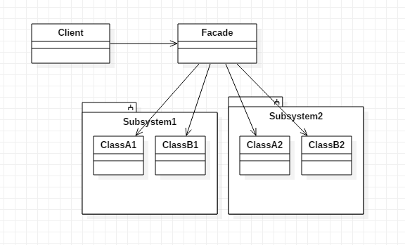
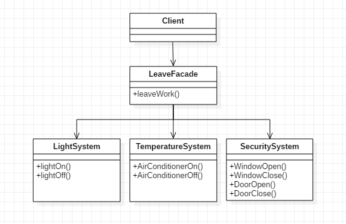
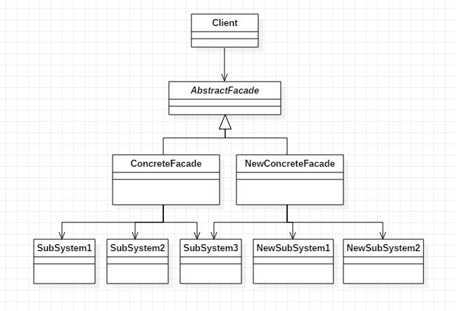

### 模式结构
外观模式包含的角色：
- 外观（Facade）：客户端直接调用的角色，在外观角色中可以知道相关的(一个或者多个)子系统的功能和责任，它将所有从客户端发来的请求委派到相应的子系统去，传递给相应的子系统对象处理
- 子系统（SubSystem）：软件系统中可以同时有一个或者多个子系统角色，每一个子系统可以不是一个单独的类，而是一个类的集合，它实现子系统的功能

### 示例
假设某公司的办公区域有一个智能管理系统，包括灯光子系统、温度子系统、安保子系统。每天下班时 会有专门的工作人员调用不同系统的接口进行相关操作，比如关灯、关门、关窗、关空调、打开安保监控系统等等，每天如此，而且内容基本一样。每天重复如此多的工作与多个系统交互会很麻烦，我们可以使用外观模式定义一个统一的接口来完成下班离开前应该完成的所有工作，这样对用户来说，整个系统使用起来就更简单。

### 具体应用分析

1. Tomcat中的Request类和RequestFacade类

Request对象中的很多方法都是内部组件之间相互交互时使用的，例如setComet、setRequestedSessionId等方法。这些方法并不对外部公开，但是又必须设置为public因为还需要跟内部组件之间交互使用。最好的解决方法就是通过使用一个Facade类，将与内部组件之间交互使用的方法屏蔽掉，只提供给外部程序感兴趣的方法。

### 应用场景
- 要为一个复杂子系统提供一个简单接口。
- 客户程序与多个子系统之间存在很大的依赖性。引入外观类将子系统与客户以及其他子系统解耦，可以提高子系统的独立性和可移植性。
- 外观模式屏蔽了子系统的细节，一定程度上保护了子系统的数据安全。所以在子系统不希望对外暴露太多细节，或者涉及到子系统相关数据敏感性，可以使用外观模式将子系统和客户系统进行隔离。

### 模式扩展
1. 抽象外观类

外观模式最大的缺点在于当增加新的子系统或者移除子系统时需要修改外观类，可以通过引入抽象外观类在一定程度上解决该问题，客户端针对抽象外观类进行编程。对于新的业务需求，不修改原有外观类，而对应增加一个新的具体外观类，由新的具体外观类来关联新的子系统对象，同时通过修改配置文件来达到不修改源代码并更换外观类的目的。

### 总结
- 在外观模式中，外部与一个子系统的通信必须通过一个统一的外观对象进行，为子系统中的一组接口提供一个一致的界面，外观模式定义了一个高层接口，这个接口使得这一子系统更加容易使用。外观模式又称为**门面模式**，它是一种对象结构型模式。
- 外观模式主要优点在于对客户屏蔽子系统组件，减少了客户处理的对象数目并使得子系统使用起来更加容易，它实现了子系统与客户之间的松耦合关系，简化了系统在不同平台之间的移植过程；其缺点在于不能很好地限制客户使用子系统类，而且在不引入抽象外观类的情况下，增加新的子系统可能需要修改外观类或客户端的源代码。
