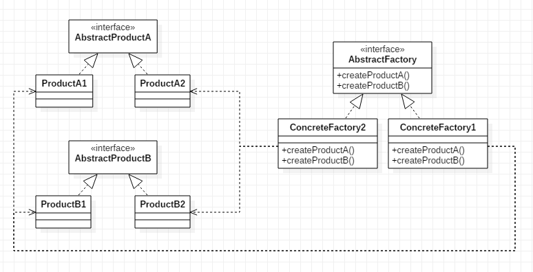
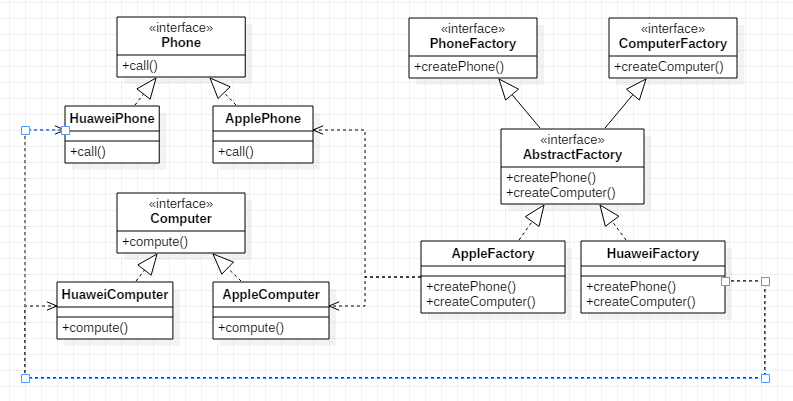
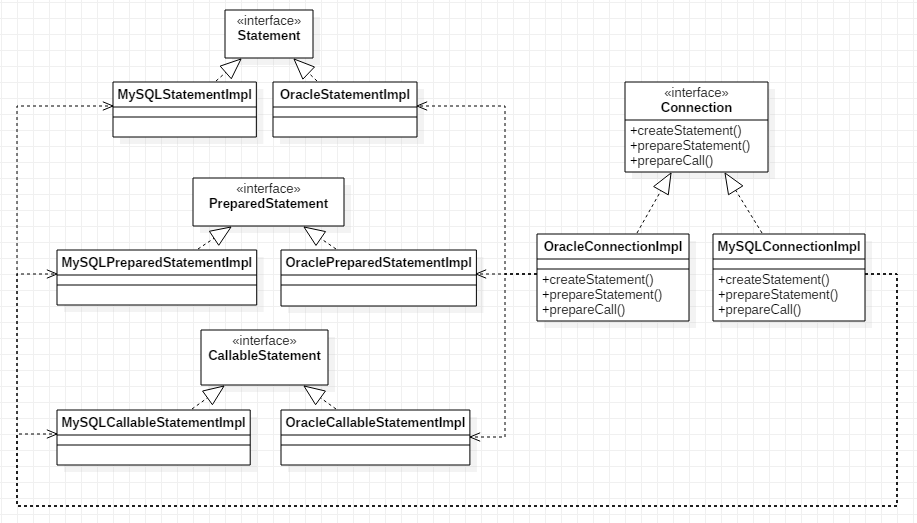

### 模式结构
我们先引入两个概念的概念：
- **产品等级结构** ：产品等级结构即产品的继承结构，如一个抽象类是手机，其子类有华为手机、苹果手机，则抽象手机与具体品牌的手机之间构成了一个产品等级结构，抽象手机是父类，而具体品牌的手机是其子类。
- **产品族**是指由同一个工厂生产的、位于不同产品等级结构的一组产品，如华为品牌下的华为手机、华为PC同属于华为产品族，Apple品牌下的苹果手机、苹果PC同属于Apple产品族。同时，华为手机、苹果手机位于手机产品等级结构，华为PC、苹果PC位于PC产品等级结构。

抽象工厂模式包含的角色：
- 抽象工厂（AbstractFactory）：用于声明生成抽象产品的方法
- 具体工厂（ConcreteFactory）：实现了抽象工厂声明的生成抽象产品的方法，生成一组具体产品，这些产品构成了一个产品族，每一个产品都位于某个产品等级结构中
- 抽象产品（AbstractProduct）：为每种产品声明接口，在抽象产品中定义了产品的抽象业务方法
- 具体产品（ConcreteProduct）：定义具体工厂生产的具体产品对象，实现抽象产品接口中定义的业务方法



图中AbstractProductA和AbstractProductB为不同类别的产品：其中ProductA1和ProductA2为同一类别，ProductB1和ProductB2为同一类别。ProductA1和ProductB1为同一产品族，均由工厂ConcreteFactory1创建；ProductA2和ProductB2为同一产品族，均由ConcreteFactory2创建。

### 示例
见本目录下的其他类



### 具体应用分析
1. java.sql.Connection
```java
public interface Connection  extends Wrapper, AutoCloseable {
	
	Statement createStatement() throws SQLException;
	
	PreparedStatement prepareStatement(String sql) throws SQLException;
	
	CallableStatement prepareCall(String sql) throws SQLException;

}
```
Connection是与特定数据库连接的抽象接口，我们希望在该连接下创建一组具有不同功能的Statement对象。

这里Connection为抽象工厂，Statement、PreparedStatement、CallableStatement为抽象产品。

对应于不同的数据库有不同的具体工厂和具体产品的实现。



此处所有的类并不是实际的实现类类名，只是为了说明对应于不同数据库有不同的具体实现。

### 应用场景
- 系统中有多于一个的产品族，而每次只使用其中某一产品族。
- 属于同一个产品族的多个产品每次一起使用。
- 例：在很多软件系统中需要更换界面主题，要求界面中的按钮、文本框、背景色等一起发生改变时，可以使用抽象工厂模式进行设计。

### 总结
- 抽象工厂模式提供一个创建一系列相关或相互依赖对象的接口，而无须指定它们具体的类。抽象工厂模式又称为Kit模式，属于对象创建型模式。
- 抽象工厂模式是所有形式的工厂模式中最为抽象和最具一般性的一种形态。抽象工厂模式与工厂方法模式最大的区别在于，工厂方法模式针对的是一个产品等级结构，而抽象工厂模式则需要面对多个产品等级结构。
- 抽象工厂模式的主要优点是隔离了具体类的生成，使得客户并不需要知道什么被创建，而且每次可以通过具体工厂类创建一个产品族中的多个对象，增加或替换产品族比较方便，增加或替换新的具体工厂就可以了；主要缺点在于增加新的产品等级结构很复杂，需要修改抽象工厂和所有的具体工厂类。


### 三种工厂模式之间的关系
- 当抽象工厂模式中每一个具体工厂类只创建一个产品对象，也就是只存在一个产品等级结构时，抽象工厂模式退化成工厂方法模式。
- 当工厂方法模式中抽象工厂与具体工厂合并，提供一个统一的工厂来创建产品对象，并将创建对象的工厂方法设计为静态方法时，工厂方法模式退化成简单工厂模式。