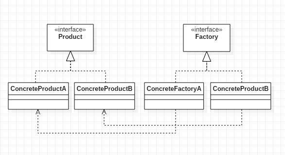
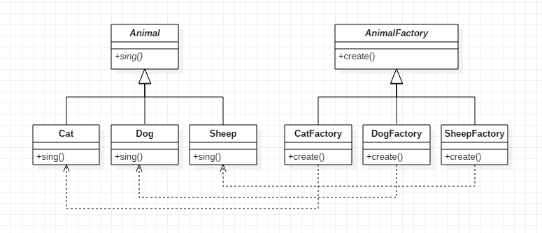
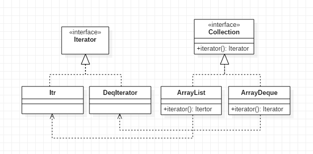

### 模式结构
工厂方法模式包含的角色：
- 抽象产品（Product）：描述具体产品的公共部分
- 具体产品（ConcreteProduct）：抽象产品的子类（实现），工厂类创建的目标
- 抽象工厂（Factory）：描述具体工厂的公共部分
- 具体工厂（ConcreteFactory）：抽象工厂的子类（实现），用来生成具体产品

### 示例
见本目录下的其他类

### 具体应用分析
1. JDK中Collection的iterator()方法

java.util.Collection接口中定义了一个抽象的iterator()方法，该方法就是一个工厂方法。
对于iterator()方法来说Collection就是一个**抽象工厂**，Collection的具体实现类如ArrayList、ArrayDeque等就是**具体工厂**。
java.util.Iterator接口是**抽象产品**，Itr（ArrayList的内部类）、DeqIterator（ArrayDeque的内部类）等作为**具体产品**。
使用不同的具体工厂类中的iterator方法能得到不同的具体产品的实例。

### 应用场景
- 一个类不知道它所需要的对象的类：客户端不需要知道具体产品类的类名，只需要知道其所对应的具体工厂即可，具体的产品对象由具体工厂创建
- 如果因为新业务需求需要频繁添加新产品，使用简单工厂方法就需要频繁修改工厂类，此时可以选择使用工厂方法模式

### 总结
- 工厂方法模式又称为工厂模式，它属于类创建型模式。在工厂方法模式中，工厂父类负责定义创建产品对象的公共接口，而工厂子类则负责生成具体的产品对象，这样做的目的是将产品类的实例化操作延迟到工厂子类中完成，即通过工厂子类来确定究竟应该实例化哪一个具体产品类
- 工厂方法模式的主要优点是增加新的产品类时无须修改现有系统，并封装了产品对象的创建细节，系统具有良好的灵活性和可扩展性；其缺点在于增加新产品的同时需要增加新的工厂，导致系统类的个数成对增加，在一定程度上增加了系统的复杂性