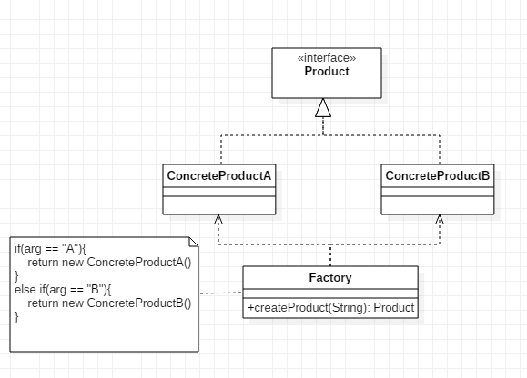
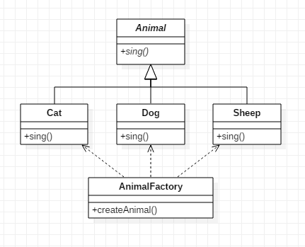

### 模式结构
简单工厂模式包含的角色：
- 工厂（Factory）：负责根据不同情况创建不同的具体产品
- 抽象产品（Product）：由工厂所创建的对象的父类，或它们共同拥有的接口
- 具体产品（ConcreteProduct）：由工厂创建的具体实例



### 示例
见本目录下的其他类



此处的Animal为抽象类

### 具体应用分析
1. JDK中的java.text.DateFormat
```java
public abstract class DateFormat extends Format{
	public final static DateFormat getDateInstance(int style);
}
```
根据不同的style创建不同的Format对象实例

2. javax.crypto.KeyGenerator
```java
public class KeyGenerator {
	public static final KeyGenerator getInstance(String var0);
}
```
根据算法名创建不同的加密算法对象实例
```
KeyGenerator keyGen=KeyGenerator.getInstance("DES");
```

3. MyBatis中的SqlSessionFactory
```java
public interface SqlSessionFactory {
	
	SqlSession openSession();

  	SqlSession openSession(boolean autoCommit);

  	SqlSession openSession(Connection connection);
  	
  	SqlSession openSession(TransactionIsolationLevel level);

  	SqlSession openSession(ExecutorType execType);

 	SqlSession openSession(ExecutorType execType, boolean autoCommit);

 	SqlSession openSession(ExecutorType execType, TransactionIsolationLevel level);

 	SqlSession openSession(ExecutorType execType, Connection connection);

 	Configuration getConfiguration();

}
```
用户不关心创建SqlSession的细节，只希望在不同情况下能够获得相应可用的SqlSession对象。

### 应用场景
- 客户端只知道传入工厂类的参数，对于如何创建对象不关心。
- 工厂类负责创建的对象比较少：由于创建的对象较少，不会造成工厂方法中的业务逻辑太过复杂。

### 总结
- 简单工厂模式又称为静态工厂方法模式，它属于类创建型模式。在简单工厂模式中，可以根据参数的不同返回不同类的实例。简单工厂模式专门定义一个类来负责创建其他类的实例，被创建的实例通常都具有共同的父类。
- 简单工厂模式最大的优点在于实现了对象创建和对象使用的分离，将对象的创建交给专门的工厂类负责；其最大的缺点在于工厂类不够灵活，增加新的具体产品需要修改工厂类的判断逻辑代码，而且产品较多时，工厂方法代码将会非常复杂。