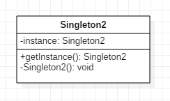

### 模式结构
Singleton2实现方式的类图



### 示例
其它实现方式见本目录下的其他类

### 具体应用分析
1. JDK中java.lang.Runtime类封装了java运行时环境。每一个java程序都启动了一个JVM进程，而每个JVM进程都将只对应一个运行时环境（Runtime实例），且此实例是由JVM为其实例化的。实现方式为饿汉式（同Singleton3）。
```java
public class Runtime {
    private static Runtime currentRuntime = new Runtime();
    
    public static Runtime getRuntime() {
    	return currentRuntime;
    }
      
    private Runtime() {}
}
```
2. MyBatis中org.apache.ibatis.executor.ErrorContext类用于记录当前执行线程下执行环境中的错误信息，一个线程只需要一个实例。
```java
public class ErrorContext {

    private static final ThreadLocal<ErrorContext> LOCAL = new ThreadLocal<ErrorContext>();

    private ErrorContext() {
    }

    public static ErrorContext instance() {
        ErrorContext context = LOCAL.get();
        if (context == null) {
            context = new ErrorContext();
            LOCAL.set(context);
        }
        return context;
    }
}    
```

### 应用场景
- 有些对象只需要一个：线程池、缓存、日志对象等。
- 对象频繁地创建和销毁。
- 对象的创建过程耗费很多资源。

### 总结
- 单例模式确保某一个类只有一个实例，而且自行实例化并向整个系统提供这个实例，这个类称为单例类，它提供全局访问的方法。单例模式的要点有三个：一是某个类只能有一个实例；二是它必须自行创建这个实例；三是它必须自行向整个系统提供这个实例。单例模式是一种对象创建型模式。
- 单例模式的主要优点在于提供了对唯一实例的受控访问并可以节约系统资源；其主要缺点在于因为缺少抽象层而难以扩展，且单例类职责过重。